# Time Scheduling System

> A Java console application that helps students plan exams, assignments, weekly fixed events, and general tasks — built with a strict MVC separation to showcase core OOP principles (inheritance, polymorphism, encapsulation).

---

## Table of Contents

1. [Project Information](#1-project-information)
2. [Presentation Video](#2-presentation-video)
3. [UML Diagram](#3-uml-diagram)
4. [How to Run](#4-how-to-run)
5. [User Guide](#5-user-guide)
6. [Project Structure](#6-project-structure)
7. [OOP Design Notes](#7-oop-design-notes)

---

## 1. Project Information

| Item | Value |
|------|-------|
| **Title** | Time Scheduling System |
| **Team** | 22500819 안희찬 (Team Leader) |
| **Language** | Java |
| **Type** | Console application |

### Description

The Time Scheduling System lets a user create, browse, edit, complete, and delete daily schedules through a card-style CLI. Schedules are divided into four categories — **Exam**, **Assignment**, **Fixed** (weekly recurring), and **General** — each with its own domain-specific fields. Priority, status, and category-based filtering are all built in, and the UI theme color can be changed on the fly.

The project was implemented as a final assignment for the Object-Oriented Programming course, and is intentionally structured to demonstrate:

- **Inheritance** — `Schedule` is an abstract parent with four concrete children.
- **Polymorphism** — every subclass overrides `getSortDate()` and `getDetailLines()` so the View renders and sorts them uniformly.
- **Encapsulation** — all model state is private; the three layers (`model`, `view`, `controller`) communicate only through defined APIs.

---

## 2. Presentation Video

▶ **YouTube**: _(insert your link here)_

---

## 3. UML Diagram

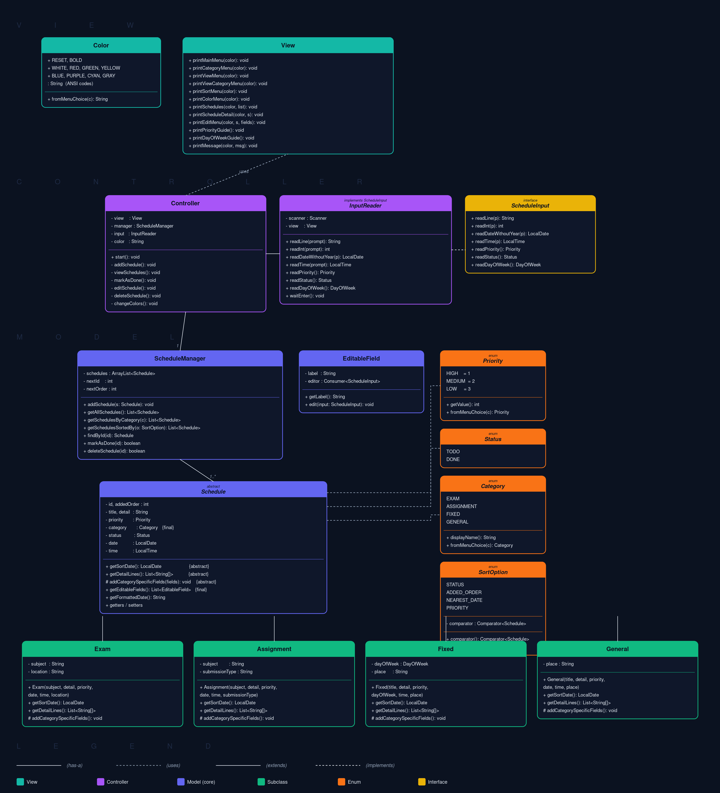

The diagram is grouped into three layers:

- **View** — `Color` (ANSI constants), `View` (rendering).
- **Controller** — `Controller` (menu flow + user input).
- **Model** — `ScheduleManager`, abstract `Schedule`, four subclasses, and the enums `Priority`, `Status`, `Category`.

---

## 4. How to Run

```bash
javac Main.java
java Main
```

The program starts at the main menu and loops until the user selects `0. Exit`.

---

## 5. User Guide

### 5.1 Main Menu

On launch, the program greets the user with the main menu. Every operation is reachable from here; selecting `0` terminates the program.

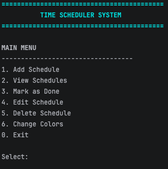

---

### 5.2 Add Schedule — `1`

Choosing `1` opens the category picker. After selecting a category, the program prompts for the fields specific to that category (e.g. Exam asks for Subject, Detail, Location, Date, Time, and Priority). The new schedule is assigned a unique ID automatically.

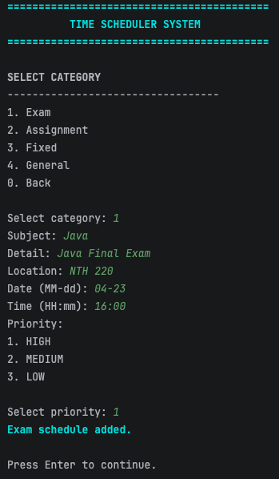

---

### 5.3 View Schedules — `2`

The view menu offers three different ways to browse schedules:

1. **View All** — every schedule in insertion order
2. **View by Category** — filter to one of Exam / Assignment / Fixed / General
3. **Sort Schedules** — reorder by status, added order, nearest date, or priority

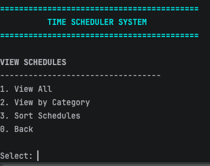

#### 5.3.1 View by Category

After choosing `2`, pick a category (e.g. Exam) and the list is filtered accordingly.

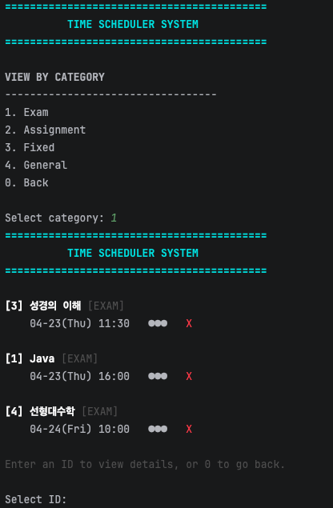

#### 5.3.2 Sort Schedules

Choose `3` to pick one of four sort modes. The screenshot below shows the list sorted by status — completed items (✓) first, then pending (✗).

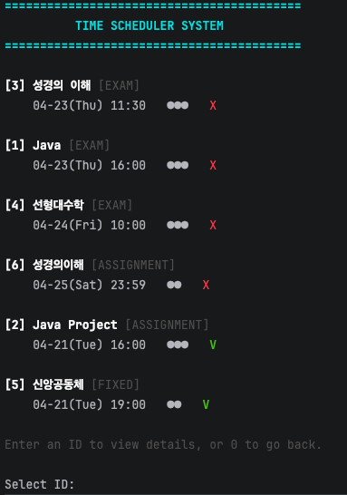

---

### 5.4 View Detail

From any schedule list, entering a schedule ID opens its detail card — showing priority dots, status, detail text, and category-specific fields (e.g. `Location` for an exam, `Place` for a fixed event).

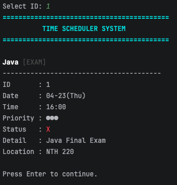

---

### 5.5 Mark as Done — `3`

Select `3`, enter the schedule's ID, and its status flips from `TODO` (X) to `DONE` (V). The change is immediately reflected in the schedule list.

<p align="center">
  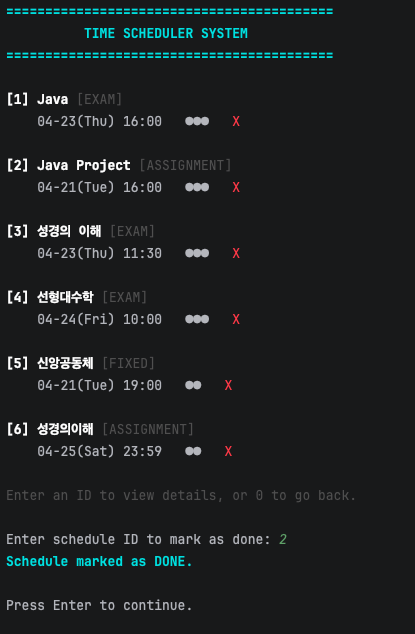
  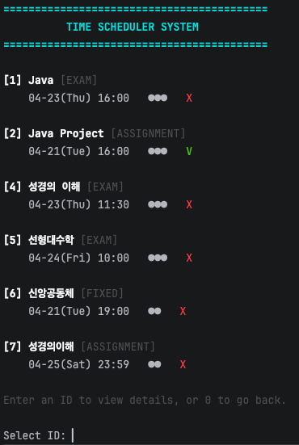
</p>

---

### 5.6 Edit Schedule — `4`

Select `4` and pick a schedule ID. The program shows a field-level edit menu (with different options per category). After saving each change, the menu loops until the user picks `0. Finish`.

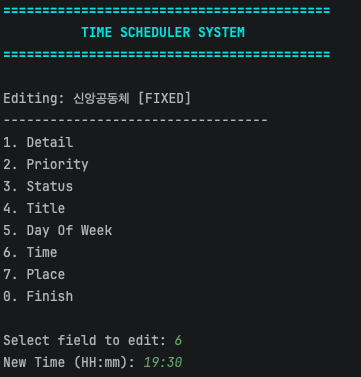

---

### 5.7 Delete Schedule — `5`

Select `5` and enter a schedule ID to remove it permanently.

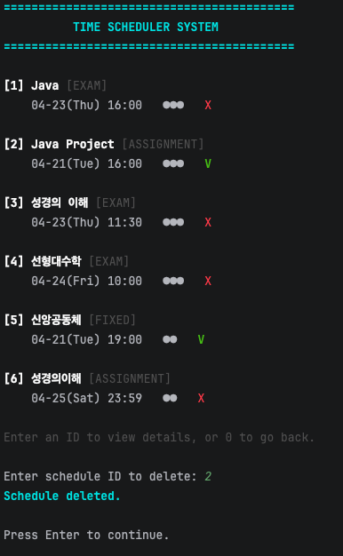

---

### 5.8 Change Theme Color — `6`

Select `6` to switch the UI accent color. The choice applies to all menus, titles, and highlights for the rest of the session.

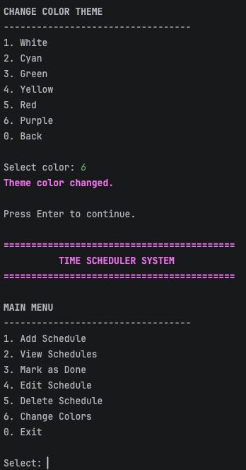

---

## 6. Project Structure

```
src/
└── timeSchedule/
    ├── Main.java
    ├── controller/
    │   └── Controller.java
    ├── model/
    │   ├── Schedule.java          (abstract)
    │   ├── Exam.java
    │   ├── Assignment.java
    │   ├── Fixed.java
    │   ├── General.java
    │   ├── ScheduleManager.java
    │   ├── Category.java          (enum)
    │   ├── Priority.java          (enum)
    │   └── Status.java            (enum)
    └── view/
        ├── View.java
        └── Color.java

images/
├── uml.png
├── main.png
├── add.png
├── view_menu.png
├── view_category.png
├── view_sort.png
├── detail.png
├── done.png
├── edit.png
├── delete.png
└── color.png

README.md
```

---

## 7. OOP Design Notes

### Inheritance

```
Schedule  (abstract)
 ├── Exam         — Subject, Location
 ├── Assignment   — Subject, Submission Type
 ├── Fixed        — Day of Week, Place    (weekly recurring, date = null)
 └── General      — Place
```

### Polymorphism

Each subclass provides its own implementation of the two abstract methods declared by `Schedule`:

| Method | Role |
|--------|------|
| `getSortDate(): LocalDate` | Returns the date used for sorting. `Fixed` computes the next occurrence of its `dayOfWeek`; all others simply return `date`. |
| `getDetailLines(): List<String[]>` | Returns the category-specific `(label, value)` rows shown in the detail card. |

This lets `ScheduleManager` sort and `View` render any `Schedule` without knowing its concrete type.

### Encapsulation

- Every field in the model is `private`.
- Mutation happens only through setters, which also keep derived state in sync (e.g. `Exam.setSubject()` also updates the schedule's `title`).
- Each layer is in its own package — `model`, `view`, `controller` — and depends only on its layer-mates and the layer directly below it.
